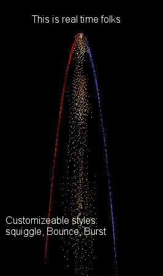



## Particle Engine

### Description

This program draws a stream of particles eminating from your cursor.They will proceed to fall to the bottom of the screen and bounce around. This is fully customizeable and would make a Great screen saver. UPDATED. LOTS OF OPTIONS!!!!
 
### More Info
 

             |
---                |---
**Submitted On**   |2000-03-20 22:00:00
**By**             |[Michael Pote](https://github.com/Planet-Source-Code/PSCIndex/blob/master/ByAuthor/michael-pote.md)
**Level**          |Advanced
**User Rating**    |4.3 (13 globes from 3 users)
**Compatibility**  |VB 3\.0, VB 4\.0 \(16\-bit\), VB 4\.0 \(32\-bit\), VB 5\.0, VB 6\.0
**Category**       |[Miscellaneous](https://github.com/Planet-Source-Code/PSCIndex/blob/master/ByCategory/miscellaneous__1-1.md)
**World**          |[Visual Basic](https://github.com/Planet-Source-Code/PSCIndex/blob/master/ByWorld/visual-basic.md)
**Archive File**   |[CODE\_UPLOAD40973202000\.zip](https://github.com/Planet-Source-Code/michael-pote-particle-engine__1-3146/archive/master.zip)

